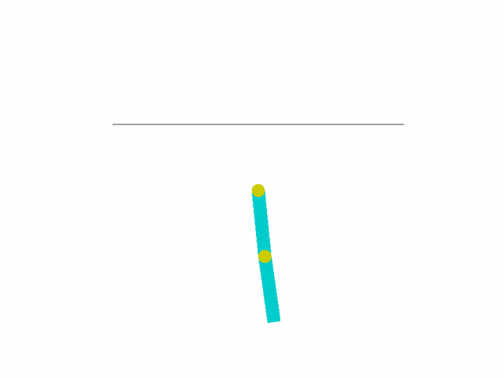
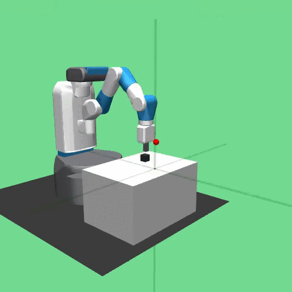

# Exploring Generalization in Deep Reinforcement Learning for Control Tasks

## Abstract

Deep reinforcement learning (DRL) has achieved significant success in addressing
various tasks; however, trained agents often struggle to generalize beyond
the environments in which they were initially trained. This thesis investigates the generalization capabilities of DRL algorithms through a series of independent experiments on control tasks of varying complexity. These tasks range from simple scenarios like Mountain Car to more complex challenges such as Pick and Place, utilizing the Gymnasium and Gymnasium-Robotics suites with the MuJoCo physics engine. Each experiment involves training a model using Proximal
Policy Optimization (PPO) within a specific environment and subsequently evaluating
its performance in slightly modified environments. The impact of hyperparameters
on generalization is also examined. The objective is to identify the
strengths and limitations of DRL agents in adapting learned policies to similar but
altered environments.

<div style="text-align: center;">
  <table style="border: none; margin: auto;">
    <tr style="border: none;">
      <td style="border: none; text-align: center;">
        
        <div>Acrobot</div>
      </td>
      <td style="border: none; text-align: center;">
        
        <div>CartPole</div>
      </td>
      <td style="border: none; text-align: center;">
        
        <div>Mountain Car Continuous</div>
      </td>
    </tr>
    <tr style="border: none;">
      <td style="border: none; text-align: center;">
        
        <div>Pendulum</div>
      </td>
      <td style="border: none; text-align: center;">
        
        <div>Pick and Place</div>
      </td>
      <td style="border: none;"></td>
    </tr>
  </table>
</div>

> ℹ️ The purpose of this README is to provide instructions and details necessary to replicate the experiments. For more comprehensive information, please consult the [Documentation](./Documentation/) directory.

## Project Structure

### [Algorithms](./Algorithms/)
Contains the implementation of Proximal Policy Optimization (PPO) applied to the different environments. Each environment has a dedicated directory following a consistent structure to ensure uniformity. These directories contain the necessary scripts and configuration files for setting up, training, and testing the models.
```bash
├── Algorithms/
│   ├── PPO_Acrobot/
│   │   ├── Experiments_Config/
│   │   │   ├── ...                # Configurations for training experiments (.yaml)
│   │   ├── Results/
│   │   │   ├── ...                # Results from training experiments (automatically)
│   │   ├── Generalization/
│   │   │   ├── ...                # Generalization experiments and results
│   │   ├── dummy_example.py       # Dummy script to test the environment setup
│   │   ├── Network_Acrobot.py     # Defines Actor-Critic networks
│   │   ├── test_Acrobot.py        # Script to test the trained models
│   │   ├── train_Acrobot.py       # Configures experiments and calls the trainer
│   │   ├── trainer_Acrobot.py     # Implements training of the model using PPO
│   ├── PPO_CartPole/              # Same structure as PPO_Acrobot
│   ├── PPO_ContinuousMountainCar/ # Same structure as PPO_Acrobot
│   ├── PPO_Pendulum/              # Same structure as PPO_Acrobot
│   ├── PPO_PickAndPlace/          # Same structure as PPO_Acrobot
```

### [Cluster](./Cluster/)
Directory related to the experiment scripts (.sh) executed on the UPF Cluster for the Pick and Place scenario, organized into folders based on different hyperparameters. Additionally, it includes the SLURM output files generated from each experiment.
```bash
├── Cluster/
│ ├── BatchSize_exp/        
│ │    ├── ...              # Experiments relateds to the Batch Size
│ ├── LearningRate_exp/         
│ │    ├── ...              # Experiments relateds to the Learning Rates
│ ├── slurms-outputs/...    
│ │    ├── ...              # Slurms obtained in each of the experiments
│ ├── Timesteps_exp/...
│ │    ├── ...              # Experiments relateds to the Timesteps
```

### [Custom Environments](./Custom_Env/)
This directory contains all the custom environments created for the generalization experiments.
```bash
├── Custom_Env/
│   ├── custom_env.py             # Script containing all custom environments
│   ├── dummy_test_custom_env.py  # Dummy script for testing the custom environments
```

## Installation

To run this project, you will need to install the required dependencies. It is recommended to use a virtual environment to manage these dependencies.

1. Clone the repository:

    ```bash
    git clone https://github.com/ialexmp/DRL-Generalization.git
    cd DRL-Generalization
    ```

2. Create and activate a virtual environment:

    ```bash
    python -m venv venv
    source venv/bin/activate  # On Windows use `venv\Scripts\activate`
    ```

3. Install the dependencies:

    ```bash
    pip install -r requirements.txt
    ```

## Usage

### Training an RL Agent

To train a reinforcement learning agent, run the following command:

```bash
python src/train.py --config configs/train_config.yaml
```
You can adjust the training parameters by editing the configuration file located in configs/train_config.yaml.

### Running Experiments
To run experiments with different configurations, use the experiment script:
```bash 
python src/evaluate.py --model-path models/agent_model.pth
```
###  Evaluating Results
After training, you can evaluate the performance of the trained agent using:
```bash 
python src/evaluate.py --model-path models/agent_model.pth
```

## Contributing

Contributions are welcome! Please fork the repository and create a pull request with your changes. Ensure that your code follows the project's style guidelines and includes relevant tests.

## License

This project is licensed under the MIT License. See the [LICENSE](./LICENSE) file for details.
